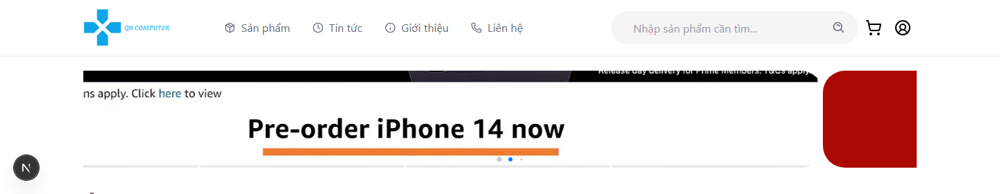

# QN Technology Store

Ứng dụng thương mại điện tử cho sản phẩm công nghệ, gồm storefront cho khách hàng và khu vực quản trị. Dự án sử dụng Next.js ở phía client và Express/MongoDB ở phía API.



## Chức năng chính

- Duyệt, tìm kiếm và xem chi tiết sản phẩm; hiển thị Flash Sales và danh mục.
- Giỏ hàng, đặt hàng, lưu thông tin giao hàng và xem lịch sử đơn theo email.
- Đánh giá sản phẩm, tin tức, trang liên hệ và trang thông báo.
- Đăng nhập người dùng với Firebase; đăng nhập quản trị bằng JWT.
- Trang quản trị để quản lý sản phẩm, đơn hàng, tin tức, liên hệ và danh sách người dùng Firebase.
- Tải ảnh đơn/nhiều ảnh và phân phối ảnh đã tải tại `/uploads`.

## Công nghệ

| Thành phần | Công nghệ |
| --- | --- |
| Frontend | Next.js 16, React 19, TypeScript, Tailwind CSS, Redux Toolkit + RTK Query |
| Backend | Node.js, Express 5, Mongoose/MongoDB |
| Xác thực | Firebase Auth/Admin và JSON Web Token |
| Giao diện | Swiper, React Multi Carousel, Lucide, React Icons, React Toastify |

## Cấu trúc dự án

```text
Frontend/                 # Next.js App Router
  src/app/                # Trang khách hàng và /admin
  src/components/         # UI, layout, form dùng lại
  src/redux/features/     # RTK Query API và cart slice
  public/                 # Tài nguyên tĩnh và ảnh giao diện README
Backend/                  # Express API
  src/routes/             # Các endpoint REST
  src/controllers/        # Xử lý nghiệp vụ
  src/models/             # Mongoose schemas
  src/middleware/         # Upload, rate limit, xác thực
  uploads/product/        # Ảnh sản phẩm đã tải lên
```

## Cài đặt và chạy cục bộ

Yêu cầu: Node.js 20+ và một MongoDB đang hoạt động. Cài dependencies cho từng dịch vụ:

```bash
cd Frontend
npm install

cd ../Backend
npm install
```

Tạo `Frontend/.env` với các biến trong `Frontend/.env.example`. Đặt `NEXT_PUBLIC_API_URL` trỏ đến API, ví dụ `http://localhost:5000/api`. Tạo `Backend/.env` với các biến trong `Backend/.env.example`; tối thiểu cần MongoDB URI, `PORT`, `JWT_SECRET` và thông tin Firebase Admin.

Chạy đồng thời hai terminal:

```bash
# Terminal 1
cd Backend
npm run dev

# Terminal 2
cd Frontend
npm run dev
```

Frontend mặc định chạy tại `http://localhost:3000`; backend dùng `PORT` trong `.env` (fallback là `5000`). CORS hiện cho phép `http://localhost:3000`.

## Scripts

| Thư mục | Lệnh | Mục đích |
| --- | --- | --- |
| `Frontend/` | `npm run dev` | Chạy Next.js với Turbopack |
| `Frontend/` | `npm run lint` | Kiểm tra quy tắc ESLint/Next.js/TypeScript |
| `Frontend/` | `npm run build` | Tạo production build |
| `Frontend/` | `npm start` | Chạy production build |
| `Backend/` | `npm run dev` | Khởi động Express server |

## API

Các route được phân nhóm dưới `/api`: `products`, `orders`, `reviews`, `contacts`, `uploads`, `news` và `admin`. Ví dụ, `GET /api/products` lấy catalog, còn `POST /api/orders/create-order` tạo đơn và cập nhật tồn kho. Ảnh đã tải được phục vụ từ `/uploads`.

## Kiểm tra trước khi đóng góp

Chạy `npm run lint` trong `Frontend/`, kiểm tra luồng UI/API liên quan khi cả hai dịch vụ đang chạy, và không commit `.env` hay khóa bí mật Firebase/MongoDB/JWT.
